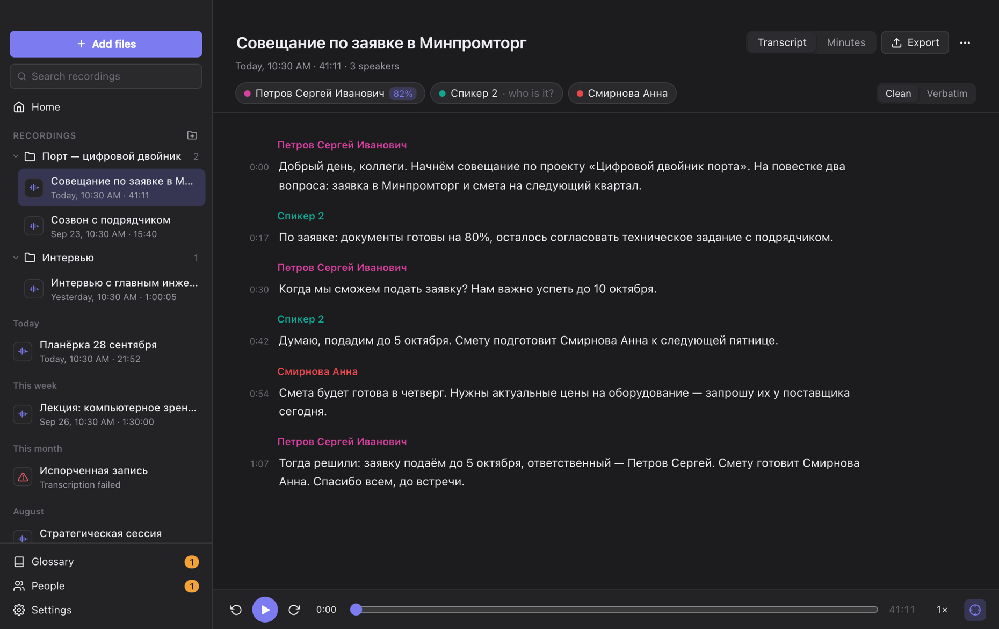
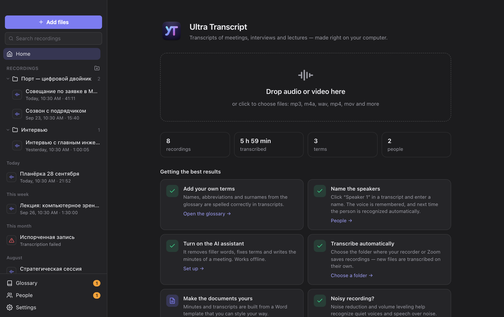

# Ultra Transcript

[Русский](README.md)

Turns recordings of meetings, interviews and lectures into clean text split by speaker — and into
minutes with decisions and action items. It runs on your own computer: recordings are not sent anywhere.

## What it does

- **Records meetings and dictation.** Press "Record" — the text appears as the conversation goes, and once
  you stop, the recording gets the full treatment: speakers, terms, minutes. You can close the window:
  the recording continues, and the menu bar icon stops it.
- **Records video calls.** "Record Video Call" (⇧⌘R) captures your microphone together with the computer's
  audio — the other side's voices from Zoom, Teams or Meet in the browser. No bot has to join the call.
  On a Mac it needs macOS 14.4 or later.
- **Transcribes audio and video.** Drop a file on the window — mp3, m4a, wav, mp4, mov and more.
  Speech recognition models to choose from: GigaAM v3, T-one, Whisper large-v3-turbo, Whisper large-v3, Parakeet TDT 0.6B v3, GLM-ASR-Nano.
- **Shows the text right away.** The transcript appears as it is recognized and the minutes are written
  before your eyes — no need to wait for processing to finish.
- **Separates speakers and recognizes voices.** Tell it once who is speaking, and that person
  is recognized in future recordings.
- **Spells terms and names correctly.** Add names, abbreviations and surnames to the glossary
  and they are written the way you need.
- **Writes minutes.** The AI assistant collects the agenda, decisions and action items with owners
  and due dates, using your template.
- **Saves to Markdown and Word.** Markdown is handy for AI tools and notes, Word for sending to colleagues.
- **Works on its own.** Choose the folder where your recorder or Zoom saves recordings, and new files
  are transcribed automatically, even when the window is closed.
- **Keeps things tidy.** Recordings go into folders, old ones into the archive, and search covers
  both titles and the text of transcripts.

## Getting started

1. **Install the app.** There are no ready-made builds yet — the app is built from source, which takes
   about ten minutes: see [Building](docs/DEVELOPMENT.md#сборка) (in Russian).
2. **Download the models.** On first launch the app offers to download the recognition models, about 215 MB.
   This is done once.
3. **Add a recording.** Drop a file on the window or click “Add files”. Text starts to appear
   in a few seconds.
4. **Name the speakers.** Click “Speaker 1” above the text and enter a name.

GigaAM v3 and T-one are Russian-only: for recordings in other languages choose Whisper, Parakeet or GLM-ASR in Settings → Speech recognition.
The interface is available in English and Russian, with light and dark themes.

## Getting the best results

- **Fill in the glossary.** Names of organizations, projects and abbreviations matter most. Under
  “Sounds like”, list how recognition gets a term wrong — those variants are fixed automatically.
  The glossary and the list of people can be imported from an Excel or CSV table.
- **Turn on the AI assistant** in Settings. It runs inside the app, offline. For English, and for
  computers with 8 GB of memory, choose Qwen3 4B.
- **Noisy recording?** Keep noise reduction and volume leveling on (Settings → Audio): they help
  recognize quiet voices and speech over noise.
- **Make the documents yours.** The minutes template is an ordinary Word document with placeholders
  like `{{decisions}}`. Style it your way; add your own placeholder, for example `{{risks}}`,
  and the assistant fills it in too.
- **Right-click** a recording, a folder or an utterance for a menu: archive, folders, export, change speaker.
- **Recording a Zoom or Teams call.** The app records from the microphone, so the other side is captured
  while the sound plays through the speakers; with headphones only your voice is recorded. Pick the
  microphone in Settings → Audio. The system asks for microphone access on the first recording.

## Privacy

Recordings, transcripts and voice profiles are stored only on your computer. Voice profiles are
encrypted. The internet is needed to download models — and for the AI assistant, if you connected
an external server to it yourself.

## Requirements

| | Mac | Windows (preliminary) |
|---|---|---|
| Transcription and voices | Apple Silicon, 16 GB of memory | 4 cores, 8 GB of memory |
| AI assistant | 16 GB of memory; 8 GB is enough for Qwen3 4B | 16 GB of memory and a GPU with 8 GB — or an external server |

Reading audio and video requires [FFmpeg](https://ffmpeg.org); on a Mac install it with
`brew install ffmpeg`.

## License

The app is free to use **for personal and any other non-commercial purposes** under the
[PolyForm Noncommercial 1.0.0](LICENSE) license. Commercial use needs the author's permission.

**Models are not part of the app.** They are included neither in the source code nor in the installer:
you download them from their developers' servers (GitHub, Hugging Face) and use them under their own
licenses — MIT, Apache 2.0, CC BY 4.0 and others. The license of every model is shown in the app
(Settings → Models) and in [THIRD_PARTY_NOTICES.md](THIRD_PARTY_NOTICES.md), which also lists
the open-source libraries the app is built on.

## For developers

Architecture, building, running without the interface and quality measurements are described in
[docs/DEVELOPMENT.md](docs/DEVELOPMENT.md) (in Russian).
