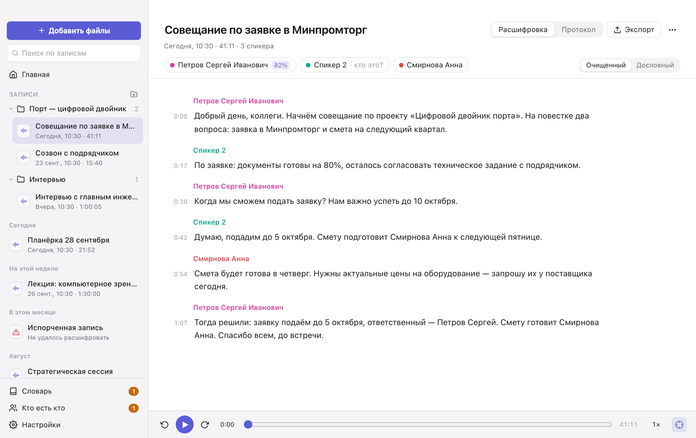
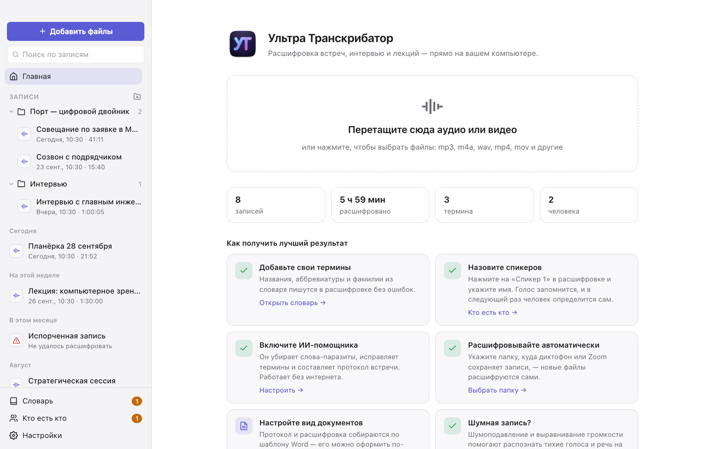
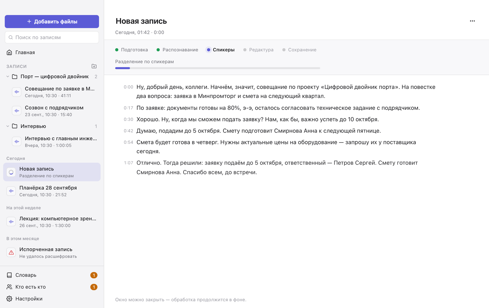
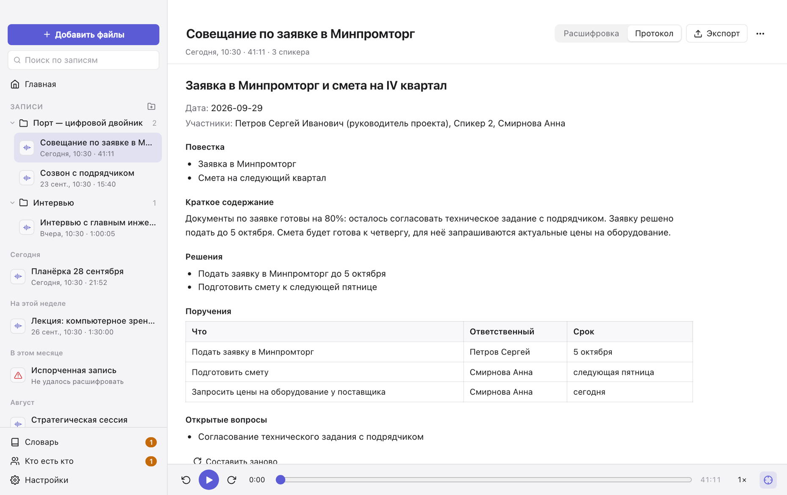
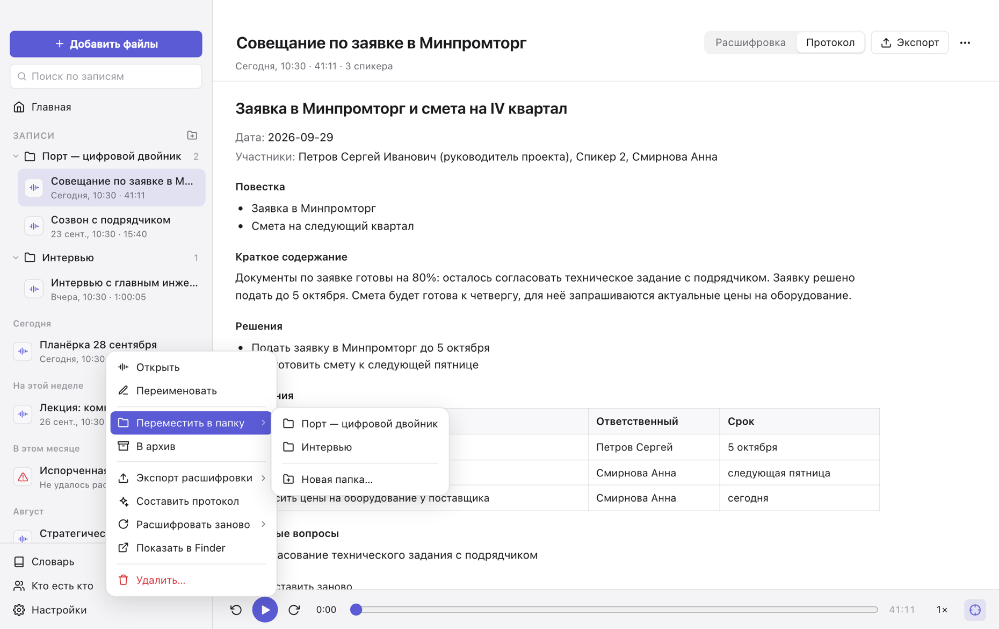

# Ультра Транскрибатор

[English](README.en.md)

Превращает записи встреч, интервью и лекций в аккуратный текст по спикерам и в протокол с решениями
и поручениями. Работает на вашем компьютере: записи никуда не отправляются.

## Что умеет

- **Записывает встречи и диктовки.** Нажмите «Записать» — текст появляется прямо по ходу разговора,
  а после остановки запись проходит полную обработку: спикеры, термины, протокол. Окно можно закрыть —
  запись продолжится, остановить её можно из строки меню.
- **Записывает видеовстречи.** «Записать видеовстречу» (⇧⌘R) пишет ваш микрофон вместе со звуком
  компьютера — голосами собеседников из Zoom, Телемоста, Meet в браузере. Ботов во встречу звать не нужно.
  На Mac нужна macOS 14.4 или новее.
- **Расшифровывает аудио и видео.** Перетащите файл в окно — mp3, m4a, wav, mp4, mov и другие форматы.
  Модели распознавания на выбор: GigaAM v3, T-one, Whisper large-v3-turbo, Whisper large-v3, Parakeet TDT 0.6B v3, GLM-ASR-Nano.
- **Показывает текст сразу.** Расшифровка появляется в окне по мере распознавания, протокол пишется
  у вас на глазах — не нужно ждать конца обработки.
- **Разделяет разговор по спикерам и узнаёт голоса.** Один раз укажите, кто говорит, — в следующих
  записях этот человек определится сам.
- **Пишет термины и фамилии правильно.** Добавьте в словарь названия, аббревиатуры и имена —
  они будут написаны в расшифровке так, как нужно вам.
- **Составляет протокол.** ИИ-помощник собирает повестку, решения, поручения с ответственными и сроками
  по вашему шаблону.
- **Сохраняет в Markdown и Word.** Markdown удобно передавать нейросетям и хранить в заметках,
  Word — отправлять коллегам.
- **Работает сам.** Укажите папку, куда диктофон или Zoom сохраняет записи, — новые файлы расшифруются
  автоматически, даже когда окно закрыто.
- **Наводит порядок.** Записи раскладываются по папкам, ненужные уходят в архив, поиск ищет
  и по названиям, и по тексту расшифровок.

| | |
|---|---|
|  |  |
|  |  |

## С чего начать

1. **Установите приложение.** Готовых сборок пока нет — приложение собирается из исходного кода,
   это занимает около десяти минут: см. [«Сборка»](docs/DEVELOPMENT.md#сборка).
2. **Скачайте модели.** При первом запуске приложение предложит скачать модели распознавания — около 215 МБ.
   Это делается один раз.
3. **Добавьте запись.** Перетащите файл в окно или нажмите «Добавить файлы». Текст начнёт появляться
   через несколько секунд.
4. **Назовите спикеров.** Нажмите на «Спикер 1» над текстом и введите имя.

Интерфейс — на русском и английском языках, светлая и тёмная темы.

## Как получить лучший результат

- **Заполните словарь.** Особенно важны названия организаций, проектов и аббревиатуры. В поле
  «Как слышится» укажите, как распознавание ошибается, — такие варианты исправятся сами.
  Словарь и список людей можно загрузить из таблицы Excel или CSV.
- **Включите ИИ-помощника** в настройках. Он работает внутри приложения, без интернета. Лучше всего
  по-русски пишет GigaChat 3.1 Lightning; для компьютера с 8 ГБ памяти подойдёт Qwen3 4B.
- **Шумная запись?** Оставьте включёнными шумоподавление и выравнивание громкости
  («Настройки → Звук»): они помогают распознать тихие голоса и речь на фоне шума.
- **Настройте документы под себя.** Шаблон протокола — обычный документ Word с метками вида `{{решения}}`.
  Оформите его как принято у вас; добавьте свою метку, например `{{риски}}`, — помощник заполнит и её.
- **Правый щелчок** по записи, папке или реплике открывает меню: архив, папки, экспорт, смена спикера.
- **Запись встречи в Zoom или Teams.** Приложение пишет с микрофона, так что собеседников слышно, пока звук
  идёт через динамики; в наушниках запишется только ваш голос. Микрофон выбирается в «Настройки → Звук».
  При первой записи система спросит разрешение на доступ к микрофону.

## Конфиденциальность

Записи, расшифровки и голосовые профили хранятся только на вашем компьютере. Голосовые профили
зашифрованы. Интернет нужен, чтобы скачать модели, — и для ИИ-помощника, если вы сами подключили
к нему внешний сервер.

## Что нужно для работы

| | Mac | Windows (предварительно) |
|---|---|---|
| Расшифровка и голоса | Apple Silicon, 16 ГБ памяти | 4 ядра, 8 ГБ памяти |
| ИИ-помощник | 16 ГБ памяти; для модели Qwen3 4B хватит 8 ГБ | 16 ГБ памяти и видеокарта с 8 ГБ — или внешний сервер |

Для чтения аудио и видео нужна программа [FFmpeg](https://ffmpeg.org) — на Mac она ставится командой
`brew install ffmpeg`.

## Лицензия

Приложением можно свободно пользоваться **в личных и любых некоммерческих целях** — на условиях
[PolyForm Noncommercial 1.0.0](LICENSE). Для коммерческого использования нужно разрешение автора.

**Модели не являются частью приложения.** Они не входят ни в исходный код, ни в установщик: вы скачиваете
их с серверов разработчиков (GitHub, Hugging Face) и пользуетесь ими по их собственным лицензиям —
MIT, Apache 2.0, CC BY 4.0 и другим. Лицензия каждой модели указана в приложении («Настройки → Модели»)
и в файле [THIRD_PARTY_NOTICES.md](THIRD_PARTY_NOTICES.md); там же перечислены открытые библиотеки,
на которых построено приложение.

## Разработчикам

Устройство приложения, сборка, проверка без интерфейса и замеры качества — в
[docs/DEVELOPMENT.md](docs/DEVELOPMENT.md).
